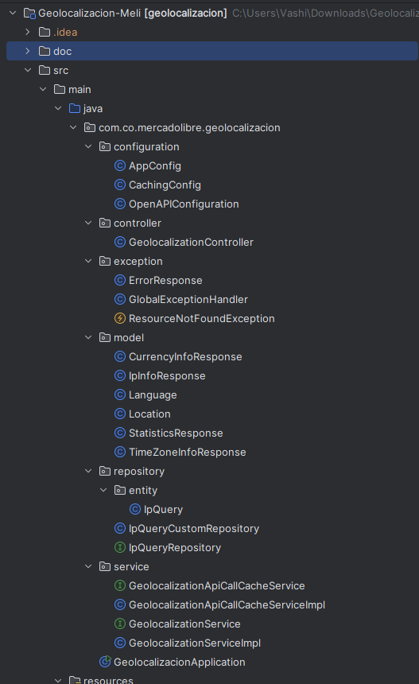

# Geolocalizacion-Meli

>   ## Empezar (docker)

```
docker build -t geolocalization-api .
docker run -p 8080:8080 geolocalization-api
```

>   ## Documentacion (API-REST)
```
http://localhost:8080/swagger-ui/index.html
```

>   ## Requisitos del Proyecto
[GeolocalizaciondeIPs.pdf](doc/GeolocalizaciondeIPs.pdf)

>   ## Diagrama Arquitectura General


>   ## Descripción de la Arquitectura de la Aplicación de Geolocalización

La aplicación de geolocalización sigue una arquitectura en capas claramente definida, lo cual es un patrón de diseño común y ampliamente adoptado en aplicaciones empresariales que buscan mantener una separación clara de responsabilidades y facilitar la mantenibilidad y escalabilidad del código. A continuación se describen las principales capas y patrones de diseño implementados en esta aplicación:

<table>
  <tr>
    <td></td>
    <td>
      1.  <strong>Capa de Configuración:</strong>
      <ul>
        <li>Configura aspectos globales de la aplicación, como caché y documentación de la API (OpenAPI).</li>
      </ul>
      2. <strong>Capa de Controlador:</strong>
      <ul>
        <li>Maneja las solicitudes HTTP entrantes y las respuestas. Expone la API REST.</li>
      </ul>
      3. <strong>Capa de Excepciones:</strong>
      <ul>
        <li>Gestiona las excepciones de manera centralizada, proporcionando respuestas de error coherentes.</li>
      </ul>
      4. <strong>Capa de Modelo:</strong>
      <ul>
        <li>Define los objetos de datos utilizados en la aplicación (e.g., IpInfoResponse, CurrencyInfoResponse).</li>
      </ul>
      5. <strong>Capa de Repositorio:</strong>
      <ul>
        <li>Se encarga de la persistencia de datos en la base de datos utilizando el patrón de Repositorio.</li>
      </ul>
      6. <strong>Capa de Servicio:</strong>
      <ul>
        <li>Contiene la lógica de negocio, coordinando las operaciones entre el controlador y el repositorio.</li>
      </ul>
      <h3>Patrones de Diseño Implementados:</h3>
      <ul>
        <li><strong>Arquitectura en Capas:</strong> Organiza el código en módulos con responsabilidades claras.</li>
        <li><strong>Patrón de Repositorio:</strong> Abstrae el acceso a la base de datos.</li>
        <li><strong>Patrón de Servicio:</strong> Encapsula la lógica de negocio.</li>
      </ul>
      Este enfoque asegura una separación clara de responsabilidades, facilitando la mantenibilidad y escalabilidad del sistema.
    </td>
  </tr>

</table>

>   ## Persistencia (NOSQL - MONGO DB)
Para manejar la persistencia de los datos en este proyecto, he optado por utilizar MongoDB, una base de datos NoSQL desplegada en la nube. MongoDB me permite almacenar de manera eficiente la información relacionada con las consultas realizadas a una misma IP, así como los cálculos asociados a estas consultas, como la distancia a Buenos Aires y otros datos relevantes. Cada vez que se realiza una consulta, los datos se guardan o actualizan en MongoDB, garantizando que cada invocación quede registrada, incluyendo la suma total de distancias y el número de invocaciones. Esto me permite mantener un historial preciso y completo de todas las consultas, asegurando la integridad de los datos incluso en situaciones de alta concurrencia.

>   ## Cache
Para optimizar el rendimiento de las llamadas a las APIs externas, he configurado un sistema de caché utilizando la implementación simple que ofrece Spring Boot. Dado que las llamadas a las APIs pueden ser costosas y pueden ser invocadas múltiples veces para la misma IP, decidí implementar un caché que almacena las respuestas de las APIs por un máximo de una hora. Este enfoque me permite reducir la carga en las APIs externas y asegurar que las respuestas, que son en su mayoría consistentes durante el mismo día, se sirvan rápidamente a partir del caché en lugar de realizar nuevas llamadas innecesarias. Con esta configuración, optimizo tanto el rendimiento como la eficiencia del sistema, garantizando una experiencia de usuario más fluida y rápida.

>   ## Concurrencia
    
utiliza operaciones atómicas de MongoDB, así puede evitar problemas de concurrencia cuando se llama al controlador varias veces al mismo tiempo. Las operaciones atómicas garantizan que las actualizaciones realizadas en el documento de MongoDB se ejecuten de manera segura, incluso en presencia de múltiples solicitudes concurrentes.

### ¿Cómo funciona?
-    Operaciones Atómicas: Las operaciones como inc() (incrementar) en MongoDB se ejecutan de manera atómica. Esto significa que si dos solicitudes concurrentes intentan actualizar el mismo documento, MongoDB garantizará que ambas actualizaciones se apliquen sin perder ninguna de ellas.
-    Evita Condiciones de Carrera: Dado que MongoDB maneja estas actualizaciones como una única operación atómica, no habrá condiciones de carrera en las que una actualización sobrescriba a la otra.
    
### Ejemplo de Funcionamiento:
1.	Solicitud A y Solicitud B llegan al mismo tiempo.
2.	Ambas solicitudes buscan el documento con la misma IP.
3.	Ambas intentan incrementar el contador de invocaciones (invocationCount) y la suma de distancias (totalDistance).
4.	MongoDB maneja las operaciones de incremento de manera que ambas actualizaciones se registran correctamente, sin perder ninguna de las actualizaciones.
Esto asegura que, independientemente de cuántas veces se llame al controlador al mismo tiempo para la misma IP, el conteo de invocaciones y la suma de distancias serán precisos.

>   ## Calculo Distancia

Para implementar el método calculateDistanceToBuenosAires, que calcula la distancia entre Buenos Aires y un punto dado en el planeta, utilizaremos la fórmula del Haversine. Esta fórmula se utiliza para calcular la distancia entre dos puntos en la superficie de una esfera (como la Tierra) dados sus latitudes y longitudes.

***Explicación de la fórmula Haversine:***

1. **Latitud y longitud:** Se toman las coordenadas de Buenos Aires y las coordenadas del país objetivo.
2. **Diferencias angulares:** Se calculan las diferencias entre las latitudes y longitudes de los dos puntos.
3. **Fórmula Haversine:** Esta fórmula se usa para calcular la distancia sobre la superficie de la Tierra utilizando la trigonometría esférica.
4. **Distancia en kilómetros:** Multiplicamos el resultado por el radio de la Tierra para obtener la distancia en kilómetros.

# Built con

* [Maven](https://maven.apache.org/) - Dependency Management
* [JAVA JDK 17](http://www.oracle.com/technetwork/java/javase/overview/index.html) - construcción
* [JUnit](https://mvnrepository.com/artifact/junit/junit) - Test Dependency
* [MONGODB](https://www.mongodb.com/) - persistencia NOSQL
* [OpenAPI](https://www.openapis.org/) - Documentación

* [Spring Boot 3.3.3](https://spring.io/projects/spring-boot) - Framework


# Autor

* **ANDRES DAVID VASQUEZ IBAÑEZ** - *Initial work* - [VASHIGO](https://github.com/vashigo)